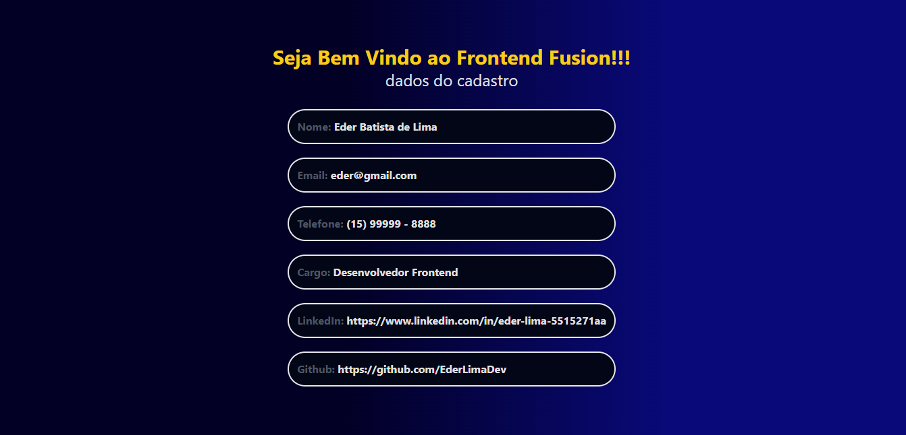
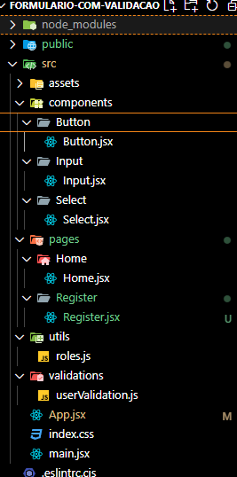

# Formulário de Cadastro de Membros

Projeto para criação de um formulário de cadastro de membros, após finalizado o cadastro o mesmo é salvo no local storage e retorna as informações em uma párina de boas vindas.

informações solicitadas no cadastro:
 Nome Completo (Obrigatório)
 Email         (Obrigatório)
 Telefone      (Obrigatório)
 Cargo - Lista (Obrigatório)
 LinkedIn      (Opcional)
 Github        (Opcional)

 *O campo Email com validação de formato

## Referência

 - [Validação de campos YUP ](https://www.npmjs.com/package/yup)

## Autor

- [Eder Lima](https://www.github.com/EderLimaDev)

## Screenshot

## Estrutura

Estrutura componentizada para facilitar a manutenção.

## Stack utilizada

**Front-end:** React, TailwindCSS

## Licença

[MIT](https://choosealicense.com/licenses/mit/)

